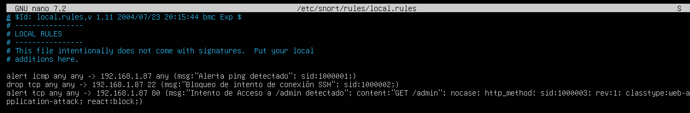

# Introducción 

>El presente documento busca demostrar configuraciones básicas que se pueden realizar en un servidor para su protección. Utilizaremos un **Ubuntu-Server 24.04.1**. La finalidad de esta configuración basada en la seguridad de la información, es la de poder proteger protocolos comúnmente usados, como lo son **SSH** o **HTTP/HTTPS**, tratando de mitigar posibles ataques de fuerza bruta y escaneos que se puedan estar realizando a nuestra red. Trataremos de lograr estos cometidos, utilizando herramientas de código abierto, como **Snort, iptables o nftables*.

# Preparación del Entorno

>Primero necesitamos descargar e instalar en una maquina virtual el servidor de Ubuntu, estos pasos están fuera del alcance de este documento. Recomendamos el uso de Ubuntu Server en su versión **20.04** o posterior. Además necesitamos acceso a **sudo** o privilegios de **root**, por lo cual debemos tener en cuenta la contraseña y el usuario que hayamos creado en todo momento de la configuración.

#### Actualización del Sistema

>Para poder realizar una actualización al sistema debemos aplicar el siguiente comando:

```shell
sudo apt update && sudo apt upgrade -y
```

#### Instalar las herramientas:

>Luego debemos instalar las herramientas a utilizar en nuestro caso utilizaremos Snort, iptables y nftables:

- **Snort:**
```shell
sudo apt install snort -y
```

>Debemos tener en cuenta, que al momento de instalar la herramienta, nos pedirá que introduzcamos la red en la cual esta estará realizando los escaneos, es un paso importante a tener en cuenta, en nuestro caso, tenemos una red domestica, es una red con un prefijo **/24**. 

- **iptables:**
```shell
sudo apt install iptables -y
```
- **nftables:**
```shell
sudo apt install nftables -y
```

>**Nota:** Por lo general iptables ya viene en el servidor por defecto.

>Además debemos instalar herramientas para ver nuestra configuración de Red y la dirección IPv4 del equipo. **ifconfig** es una buena opción para esto. Podemos instalarla utilizando el comando:

```shell
sudo apt install net-tools
```

>Con esta herramienta podremos visualizar el prefijo de la red en la cual estamos operando, que será necesario para la configuración de la herramienta Snort como mencionamos anteriormente, se vería algo así:


# Configuración de Snort

>Luego de haber instalado la herramienta, debemos realizar las reglas que estaremos aplicando a nuestra red local, para ello debemos ir al archivo "**/etc/snort/rules/local.rules**". En este archivo debemos ir realizando las reglas de control que nuestro IPS seguirá para la protección de la red.


>Como podemos ver aquí creamos una regla básica, las reglas de Snort son un mundo aparte que debemos investigar, es una herramienta tan flexible que, podría hasta ser configurada para la detección de CVE's. Las reglas avanzadas están fuera del alcance de este documento.

### Esquema Básico de una Regla de Snort

>El esquema es el siguiente:

- [Acción] \ [Protocolo] \ [IP_origen] \ [Puerto_origen] -> [IP_destino] \ [Puerto_destino] ([Opciones de Reglas])

>Donde, toda la sección, antes de llegar a las opciones de reglas se conoce como el **Encabezado.** El encabezado contiene la acción, protocolo, direcciones IP origen y destino. Ahora tomemos como ejemplo la regla que vemos en la imagen.

```snort
alert icmp any any -> 192.168.1.87 any (msg:"Alerta ping detectado"; sid:100001)
```

- Tenemos la acción a realizar en este caso tenemos **alert**, es decir que generamos una alerta que se registrará en los logs.
- Luego tenemos el protocolo, en este caso el protocolo **ICMP**, debemos recordad que ping, envía echo's ICMP para poder encontrar hosts en una red.
- Luego tenemos tanto la dirección IP como el puerto, el cual especificamos como **"any"** y **"any"**, lo que significa que provenga de cualquier dirección y desde cualquier puerto.
- Seguido tenemos la dirección IP destino y el Puerto destino. Donde en este casó especificamos la dirección IP del servidor, el cual pudimos averiguar con la herramienta **ifconfig**, y luego tenemos "**any**" de nuevo especificando cualquier puerto destino.
- En las opciones de regla establecemos un mensaje "**msg:**" el cual indica un ping detectado hacia nosotros. Y luego un identificador de la regla **"sid"**. 

>Ahora que ya sabemos el esquema básico de las reglas podremos crear nuestras reglas para la finalidad de esta practica donde debemos proteger el protocolo SSH o tratar de proteger un servicio HTTP/HTTPS que estemos corriendo para ellos podemos utilizar las siguientes reglas. 

```snort
alert tcp any any - 192.168.1.87 22 (msg:"Intento de intento de conexión SSH"; sid:1000002)
```


>Esta es un ejemplo de una regla que alerte el intento de conexión mediante el protocolo SSH para cualquier dirección IP desde cualquier puerto. Esta es una regla que no es muy optima debido a que nosotros de igual manera en algunas ocasiones necesitaremos conectarnos a nuestro servidor por SSH.

>Para poder realizar reglas reglas realmente flexibles snort cuenta con la posibilidad de utilizar variable que son definidas en el archivo **snort.conf**, pero dichas reglas "más avanzadas", estarán fuera de esta practica. 

>Ahora crearemos una regla un poco más avanzada para la protección del servicio HTTP/HTTPS, suponiendo que tenemos una ruta **"/admin"** a la cual no queremos que externos tengan acceso.

```snort
alert tcp any any -> any 80 (msg:"Inteno de acceso a /admin detectado"; content:"GET /admin"; nocase; http_method; sid:1000003; rev:1; classtype:web-application-attack; react:block;)
```

>**Explicación de la regla:**

- **`alert tcp any any -> any 80`**: Detecta tráfico TCP desde cualquier IP y puerto hacia cualquier IP en el puerto 80 (HTTP).
- **`content:"GET /admin"; nocase; http_method;`**: Busca la solicitud HTTP con el método `GET` hacia el recurso `/admin`, ignorando mayúsculas y minúsculas.
- **`sid:1000003;`**: Identificador único de la regla. Es importante que cada regla tenga un `sid` único.
- **`react:block;`**: Esta opción le indica a Snort que bloquee el acceso cuando la regla se active.

>Esta es una regla que demuestra la eficacia de Snort como tanto un IDS como un IPS, protegiendo al servidor de posibles amenazas. Cade destacar lo escalable de la herramienta, puesto que, puede proteger a toda una red.



>Así se vería nuestro archivo de reglas locales de Snort. Ahora demos activar el poder registrar los logs para su posterior revisión, acotando que Snort es una excelente herramienta que se puede complementar con la implementación de SIEMS.

# Configuración de iptables y nftables

>Ya tenemos nuestra regla de Snort que monitorea los intentos de acceso a la conexión SSH, ahora digamos que queremos proteger dicha conexión SSH a posibles ataques de fuerza bruta, para ello podemos utilizar tanto **iptables** como **nftables:**

### Configuración con iptables

>Para esta configuración aplicaremos dos reglas las cuales iremos explicando:

```bash
sudo iptables -A INPUT -p tcp --dport 22 -m conntrack --ctstate NEW -m recent --set
sudo iptables -A INPUT -p tcp --dport 22 -m conntrack --ctstate NEW -m recent --update --seconds 60 --hitcount 5 -j DROP
```

>Donde:

- **`-A INPUT`**: Añade una regla a la cadena de entrada (`INPUT`).
- **`-p tcp --dport 22`**: Filtra los paquetes que utilizan el protocolo TCP en el puerto 22 (SSH).
- **`-m conntrack --ctstate NEW`**: Hace seguimiento de las conexiones, limitando las conexiones nuevas.
- **`-m recent --set`**: Guarda la IP de origen en la lista "recent" para monitorear intentos futuros.
- **`--update --seconds 60 --hitcount 5`**: Bloquea la IP si se detectan 5 intentos en 60 segundos.
- **`-j DROP`**: Esta acción descarta los paquetes cuando se exceden los intentos permitidos.


>Una vez realizada la configuración intento el acceso mediante fuerza bruta implementando la herramienta hydra desde una máquina Kali Linux atacante. 


>Ahora si vamos a los logs del servidor veremos como luego de los 5 intento fallidos, se bloquea la conexión. 


### Configuración de nftables

>Ahora **nftables** es una versión mejorada de **iptables** puesto que ofrece un mejor control, entonces haremos lo siguiente, primero, borraremos las reglas de **iptables** que teníamos antes.

```shell
sudo iptables -F
```

>Ahora debemos habilitar e iniciar el servicio de nftables

```shell
sudo systemctl enable nftables
sudo systemctl start nftables
```

>Luego debemos **Crear nuestra tabla**, en nuestro caso se llamará ***"protection"***.

```shell
sudo nft add table inet protection
```

>Luego de crear nuestras tablas, debemos crear una cadena que **regule** los paquetes entrantes, esta debe ser una cadena de tipo **filter**, para filtre los paquetes.

```shell
sudo nft add chain inet protection input { type filter hook input priority 0 \; }
```

>El comando final **`priority 0 \;`** establece niveles de prioridad que seguirá nftables para el filtrado de paquetes, el nivel 0 es el más bajo. Ahora demos crear de igual manera la cadena para los paquetes de salida:>

```shell
sudo nft add chain inet protection output { type filter hook output priority 0 \; }
```

>Una vez creada las tablas y las la cadena, podemos crear nuestras reglas, para por ejemplo el bloqueo de trazas **ICMP**, para evitar los PING al servidor.

```shell
sudo nft add rule inet protection input ip protocol icmp drop
```

>Esto bloquea el trafico entrante **"input"**, ahora demos aplicar el bloqueo al trafico saliente **"output"**.

```shell
sudo nft add rule inet protection output ip protocol icmp drop
```

>Luego de haber creado las reglas podemos visualizar nuestra tabla de **nftables** con el comando:

```shell
sudo nft list table inet protection
```


>Ahora podemos intentar el realizar un **ping** desde nuestra máquina atacante:


>Como podemos ver, el ping no es aceptado, por lo cual no tiene respuesta de parte del servidor.

>Por ultimo podemos aplicar la protección de fuerza bruta al servicio SSH, lo podemos lograr de la siguiente forma:

```shell
sudo nft add rule inet protection input tcp dport 22 ct state new limit rate 5/minute drop
```

nft add rule inet filter input tcp dport 22 ct state new limit rate 5/minute burst 10 drop

- **`tcp dport 22`**: Esto filtra el tráfico dirigido al puerto 22 (SSH).
- **`ct state new`**: Solo toma en cuenta las conexiones nuevas.
- **`counter`**: Incrementa el contador de paquetes procesados por esta regla.
- **`limit rate 5/minute`**: Limita el número de nuevas conexiones permitidas a 5 por minuto.
- **`drop`**: Bloquea los paquetes que exceden el límite establecido.

>Al ir a nuestra máquina atacante y realizar el ataque con hydra vemos lo siguiente:


# Resumen

>Estas configuraciones básicas, buscan educar en temas de seguridad de la información. Son configuraciones básicas, que pueden ser mejoradas y adaptadas a situaciones reales según las necesidades de cada persona. Esperamos sean de ayuda y cualquier aporte que quieran realizar para la mejora continua es bien recibida. Gracias.

